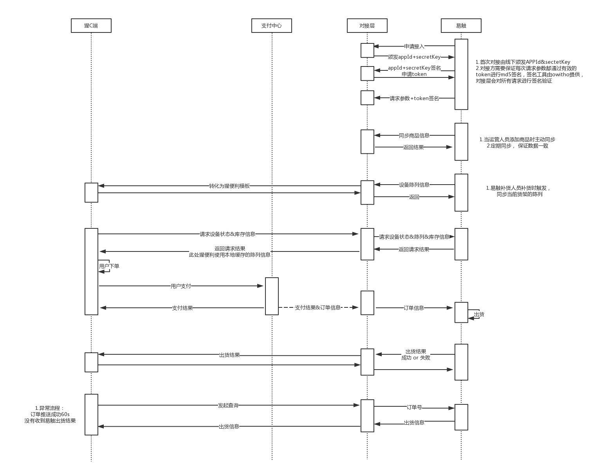

# owitho开放平台接入指南
| 日期	    | 版本 	 | 说明	|   作者	     |
| -----------  | ------ | ----------------| ------ |
|2018年5月19日|v0.1.0|初稿| 钟杨杨|
|2018年5月20日|v0.1.1|添加了同步陈列接口, 增加了接口详细描述以及部分接口的补充描述, 更新了流程图添加了auth部分流程| 罗迪|
|2018年5月22日|v0.1.2|更新了auth接口，增加utc字段| 钟杨杨|
|2018年5月23日|v0.1.3|在陈列推送以及查询机器详情的接口中添加了行&列| 赵亚东|
|2018年5月23日|v0.1.4|添加了单machine多货柜支持, 添加了订单接口中规划货道| 罗迪|
|2018年5月30日|v0.1.5|验签支持多签名，删除urlEncode,明确业务接口入参格式| 钟杨杨|
## 接入说明
```
owitho开放平台是允许第三方使用点位服务的平台,owitho平台针对每个接入方平台账号会产生一个唯一的App Id,相对应App Id还会分配一个Secret Key,用于验证身份的合法性.第三方需要完成线下注册, 得到相应的App Id和Secret Key.
```
```
开发人员在接入实际业务接口前,要理解开放平台的签名和认证机制,业务接口以统一授权方式作为认证依据.
```
## accessToken获取以及签名方法	

### accessToken获取:
```
 * accessToken是第三⽅平台的全局唯一票据，第三方调⽤各接口时都需使用accessToken。第三方需要进行妥善保存。
 * accessToken的存储至少要保留512个字符空间。accessToken的有效期目前为24个小时，需定时刷新，重复获取将导致上次获取的accessToken失效。
 * 开放平台以accessToken为接⼝调⽤凭据，来调用接口，所有接口的调用需要先获取accessToken，accessToken在24⼩时内有效，过期需要重新获取，但一天内获取的次数有限，开发者需要自行存储。
```
### 第三方平台API调用所需的accessToken的使用及生成方式说明:
```
 	1、为了保密secretKey，第三方需要⼀一个accessToken获取和刷新的中控服务器。⽽而其他业务逻辑服务器所使⽤的accessToken均来⾃于该中控服务器，不应该各⾃去刷新，否则会造成accessToken覆盖而影响业务;
 	2、目前accessToken的有效期通过返回的expire_time来传达，目前是24⼩时。中控服务器需要根据这个有效时间提前去刷新新accessToken。在刷新过程中，中控服务器对外输出的依然是老accessToken，此时开放平台后台会保证在刷新短时间内，新老accessToken都可用，这保证了第三⽅业务的平滑过渡;
 	3、accessToken的有效时间可能会在未来有调整，所以中控服务器不仅需要内部定时主动刷新，还需要提供被动刷新accessToken的接口，这样便于业务服务器在API调用获知accessToken已超时的情况下，可以触发accessToken的刷新流程。
	4、第三方平台可以使用appId和secretKey调⽤获取accessToken接⼝来获取accessToken
```
### 1. 获取accessToken接口
#### 接口调用请求说明:
```
 ${owitho.url}/getAccessToken?appId=4cdbc040657a4847b2667e31d9e2c3d9&salt=2345&utc=1526697000000&signature=9b7d70ab7f45d1256948811b91660c30
 ${owitho.url}需要更换为正确的地址, 地址见附录 
```
| 请求参数名	    | 类型 	 | 必填	|   长度	      | 说明 | 备注 |
| -----------  | ------ | ------| ----------------| ----| --- |
|appId|String|Y|-|第三方平台appId|
|salt|int|Y|-|1000-9999内随机数|
|utc|long|Y|-|请求时间戳|毫秒|
|signature|String|Y|-|签名|

#### 签名计算规则:
(1) 将所有参数(signature除外)拼接(包括用户的secretKey)，并用&连接。所有接口的请求
方法GET/POST/PUT/DELETE的请求参数在计算signature之前需要进行utf-8编码

```
appId=4cdbc040657a4847b2667e31d9e2c3d9&salt=2345&utc=1526697000000&secretKey=fresh
```
(2) 用(1)中字符串计算MD5，得到签名

```
9b7d70ab7f45d1256948811b91660c30
```

#### 返回说明:
```
{
    "code":200,
    "msg":"success",
    "data":{
        "accessToken":"accessToken",
        "expireTime":1452570728594
    }
}
```
| 请求参数名	    | 类型 	 | 必填	|   长度	      | 说明 | 备注 |
| -----------  | ------ | ------| ----------------| ----| --- |
|code|int|Y|-|状态码|
|msg|String|Y|-|返回信息|
|accessToken|String|Y|-|获取到的凭证|
|expireTime|long|Y|-|凭证到期时间（毫秒）|

错误时开放平台会返回错误码等信息，JSON数据包示例如下(该示例为AppID无效错误):

```
{
    "code":40001,
    "msg":"invalid appId",
    "data":{

    }
}
```

### 2.第三方平台请求时签名的计算规则:
#### 第三方平台API调用必须严格按照如下数据格式：
```
{
    "appId":"4cdbc040657a4847b2667e31d9e2c3d9",
    "data":"{\"name\":\"张三\",\"age\":23,\"country\":\"中国\"}",
    "salt":1234,
    "utc":1526697000000,
    "signatures":[
        "5fff5b80aeeef36e1c066b1004ec0262"
    ]
}
```
```
salt为1000-9999随机数
utc为请求发起的时间（毫秒单位时间戳）
```

#### 签名计算规则:
##### (1) 首先获取请求内容data对应的json字符串

```
{"name":"张三","age":23,"country":"中国"}
```
##### (2) appId, accessToken，以及上述字符串data、salt、utc用&拼接起来（如本地的accessToken已失效，需要向owitho平台重新获取有效的accessToken）
```
appId=4cdbc040657a4847b2667e31d9e2c3d9&accessToken=9e7d0604-cb0d-4c7c-a09d-cf365ce6936c&data={"name":"张三","age":23,"country":"中国"}&salt=1234%26utc%3D1526697000000
```
##### (3) 用（2）中字符串计算MD5，得到签名
```
5fff5b80aeeef36e1c066b1004ec0262
```

### 第三方平台接收请求时的验签规则
#### owitho开放平台调用第三方API数据格式如下：
```
{
    "appId":"4cdbc040657a4847b2667e31d9e2c3d9",
    "data":"{\"name\":\"张三\",\"age\":23,\"country\":\"中国\"}",
    "salt":1234,
    "utc":1526697000000,
    "signatures":[
        "5fff5b80aeeef36e1c066b1004ec0262",
        "3cda5b80aeeef36e1c066b101dac0314"
    ]
}
```
```
salt为1000-9999随机数
utc为请求发起的时间（毫秒单位时间戳）
```
#### 验签计算规则:
##### (1) 首先获取请求内容data对应的json字符串

```
{"name":"张三","age":23,"country":"中国"}
```
##### (2) appId, accessToken，以及上述字符串data、salt、utc用&拼接起来（如本地没有有效的accessToken，使用secretKey的值替代accessToken的值）
```
appId=4cdbc040657a4847b2667e31d9e2c3d9&accessToken=9e7d0604-cb0d-4c7c-a09d-cf365ce6936c&data={"name":"张三","age":23,"country":"中国"}&salt=1234%26utc%3D1526697000000
```
##### (3) 用（2）中字符串计算MD5，得到签名
```
5fff5b80aeeef36e1c066b1004ec0262
```
##### (4) 获取请求中得signatures数组
```
"signatures":[
        "5fff5b80aeeef36e1c066b1004ec0262",
        "3cda5b80aeeef36e1c066b101dac0314"
    ]
```
##### (5）判断（4）中得到的signatures数组包不包含（3）中计算得到的MD5签名，包含则验签通过，不包含则验签失败


# 业务流程



# 业务接口
```
以下所有业务接口，data中数据在请求中必须转为不带空格和换行符的字符串
```

## 1. 增量同步第三方商品信息接口

```
POST  ${owitho.url}/sku/sync
```
### 描述
```
当第三方接入owitho平台时, 需要第三方的商品信息,包括(商品编号,商品名称,商品图片等),以增量方式同步第三方商品信息到owitho平台
```

### 接口说明
```
请保证商品编号的唯一性,当商品编号重复同步时我们的策略是覆盖
```

### API版本
```
0.1
```

### 调用方式
```
POST
```

### 请求参数
| 请求参数名	    | 类型 	 | 必填	|   长度	      | 说明 | 备注 |
| -----------  | ------ | ------| ----------------| ----| --- |
| skuList |ArrayList\<Sku>|Y|-|商品列表| Sku数据结构见下表


| 请求参数名	    | 类型 	 | 必填	|   长度	      | 说明 | 备注 |
| -----------  | ------ | ------| ----------------| ----| --- |
|skuCode|String|Y|-|商品编号| 能够唯一表示商品信息的标识
|skuName|String|Y|-|商品名称|
|skuUnit|String|Y|-|商品单位|如：瓶、罐
|skuSpec|String|Y|-|商品规格|如：100ml
|originalPrice|String|Y|-|商品原始售价|
|purchasePrice|String|N|-|商品进价|
|skuPic|String|Y|-|公网可访问的商品图片url|

```
{
    	skuList:[
			{
				 "skuCode":"200000001",
   			     "skuName":"可口可乐",
   			     "skuUnit":"罐",
   			     "skuSpec":"250ml",
   			     "originalPrice":"10.50",
   			     "purchasePrice":"5.50",
    			 "skuPic":"https://img.xingbianli.cn/%08cola.png"
			},
			{
				 "skuCode":"200000037",
   			     "skuName":"天喔茶庄蜂蜜柚子茶",
   			     "skuUnit":"瓶",
   			     "skuSpec":"180ml",
   			     "originalPrice":"9.50",
   			     "purchasePrice":"4.50",
    			 "skuPic":"https://img.xingbianli.cn/%08cola.png"
			}
    	]
}
```

### 请求参数示例

```
{
    "appId":"2922b949feae2e8f870414e9442b0611",
    "salt":2121,
    "signatures":[
        "bf36b8bd69ca354a0985f59c415fc719"
    ],
    "utc":1527660769983,
    "data":"{\"skuList\":[{\"skuCode\":\"1235324\",\"skuName\":\"可乐\",\"skuUnit\":\"罐\",\"skuSpec\":\"250ml\",\"originalPrice\":10.5,\"purchasePrice\":9.5,\"skuPic\":\"https://pic.png\"},{\"skuList\":[{\"skuCode\":\"1235324\",\"skuName\":\"可乐\",\"skuUnit\":\"罐\",\"skuSpec\":\"250ml\",\"originalPrice\":10.5,\"purchasePrice\":9.5,\"skuPic\":\"https://pic.png\"}]}"
}
``` 

### 返回参数说明
| 返回参数名	    | 类型 	 | 说明 | 备注|
| -----------  | ------ | ------| ----|
|code|int|状态码|
|msg|String|返回信息|
|data|String|返回数据|

### 返回结果示例

成功返回值

```
{
	"code":"200",
    "msg":"success",
    "data":""
}
```

失败返回值 [详见附录](#通用返回码)

```
{
    "code":"40000",
    "msg":"请求失败",
    "data":""
}
```

## 2. 第三方补货时主动同步当前货架的陈列

```
POST  ${owitho.url}/machine/sync

```

### 描述
```
第三方补货人员在补货时触发,同步当前货架的陈列给owitho平台
```
### 接口说明
```
当存在合并货道时,开放平台不关心具体的合并逻辑,第三方只需要合并后的货道列表同步给开放平台即可.
示例:当前货道为1,2,3,4,5,6 此时将2,3货道合并后,同步的货道列表为1,2(合并后货道唯一标识),4,5,6
开放平台不关心2是货道2还是货道3
```

### API版本
```
0.1
```

### 调用方式
```
POST
```

### 请求参数
| 请求参数名	    | 类型 	 | 必填	 | 说明 | 备注 |
| -----------  | --------- | ------| ----------------| ----| 
|machineCode|String|Y|机器code|
|containerCode|String|N|货柜号|
|machineStatus|Int|Y|机器状态|10:正常，20:机器离线，30:机器机械故障[详见附录](#机器状态)|
|slotList |ArrayList\<Slot>|Y|货道陈列详情|Slot数据结构见下表

| 请求参数名	    | 类型 	 | 必填	 | 说明 | 备注 |
| -----------  | ------ | ------| ----------------| ----|
|slotNum|String|Y|货道号|
|row|Int|Y|行|
|col|Int|Y|列|
|skuCode|String|Y|商品编码|
|skuName|String|Y|商品名称|
|skuDesc|String|N|商品描述|
|originalPrice|String|Y|商品原始售价|
|actualPrice|String|Y|商品真实售价|
|maxInventory|Int|Y|最大库存数量|
|currentInventory|Int|Y|实时库存数量|
|slotStatus|Int|Y|货道状态|0:正常，其他:货道故障[详见附录](#货道状态)|
```
{
    "machineCode":"XHJSHnull1990000000108714",
    "containerCode":"abc123",
    "machineStatus":10,
    "slotList":[
        {
            "slotNum":"01",
            "row":1,
            "col":1,
            "skuCode":"0000001",
            "skuName":"600ml可口可乐",
            "skuDesc":"600ml可口可乐",
            "originalPrice":"10.50",
            "actualPrice":"10.50",
            "maxInventory":10,
            "currentInventory":3,
            "slotStatus":0
        },
        {
            "slotNum":"02",
            "row":1,
            "col":2,
            "skuCode":"0000002",
            "skuName":"原味乐事薯片",
            "skuDesc":"原味乐事薯片",
            "originalPrice":"10.50",
            "actualPrice":"10.50",
            "maxInventory":10,
            "currentInventory":5,
            "slotStatus":0
        }
    ]
}
```

## 请求参数示例
```
{
    "appId":"4cdbc040657a4847b2667e31d9e2c3d9",
    "salt":1234,
    "signature":[
        "5fff5b80aeeef36e1c066b1004ec0262"
    ],
    "utc":1526697000000,
    "data":"{\"machineCode\":\"XHJSHnull1990000000108714\",\"containerCode\":\"abc123\",\"machineStatus\":10,\"slotList\":[{\"slotNum\":\"01\",\"row\":1,\"col\":1,\"skuCode\":\"0000001\",\"skuName\":\"600ml可口可乐\",\"skuDesc\":\"600ml可口可乐\",\"originalPrice\":\"10.50\",\"actualPrice\":\"10.50\",\"maxInventory\":10,\"currentInventory\":3,\"slotStatus\":0},{\"slotNum\":\"02\",\"row\":1,\"col\":2,\"skuCode\":\"0000002\",\"skuName\":\"原味乐事薯片\",\"skuDesc\":\"原味乐事薯片\",\"originalPrice\":\"10.50\",\"actualPrice\":\"10.50\",\"maxInventory\":10,\"currentInventory\":5,\"slotStatus\":0}]}"
}

```

### 返回参数
| 返回参数名	    | 类型 	 | 说明 | 备注|
| -----------  | ------ | ------| ----|
|code|int|状态码|
|msg|String|返回信息|
|data|String|返回数据|

### 返回参数示例


```
{
	"code":"200",
    "msg":"success",
    "data":""
}
```

## 3. 根据机器code查询商品陈列、库存以及设备状态（第三方实现）

```
POST  ${third.url}/machine/query

```

### 描述
```

根据第三方机器code实时查询该机器的商品陈列、库存以及设备状态
```
### 接口说明
```
${third.url}为第三方平台的url，第三方需要在注册的时候提供

注意:当存在合并货道时,开放平台不关心具体的合并逻辑,第三方只需要合并后的货道列表同步给开放平台即可.
示例:当前货道为1,2,3,4,5,6 此时将2,3货道合并后,同步的货道列表为1,2(合并后货道唯一标识),4,5,6
开放平台不关心2是货道2还是货道3
```

### API版本
```
0.1
```

### 调用方式
```
POST
```

### 请求参数
| 请求参数名	    | 类型 	 | 必填	 | 说明 | 备注 |
| -----------  | ------ | ------| ----------------| ----| 
|machineCode|String|Y|机器code|

```
{
    "machineCode":"XHJSHnull1990000000108714"
}
```


## 请求参数示例
```
{
    "appId":"4cdbc040657a4847b2667e31d9e2c3d9",
    "salt":1234,
    "signatures":[
        "bf36b8bd69ca354a0985f59c415fc719"
    ],
    "utc":1526697000000,
    "data":"{\"machineCode\":\"XHJSHnull1990000000108714\"}"
}

```

### 返回参数
| 请求参数名	    | 类型 	 | 必填	 | 说明 | 备注 |
| -----------  | ------ | ------| ----------------| ----| 
|machineCode|String|Y|机器code|
|containerCode|String|N|货柜号|
|machineStatus|Int|Y|机器状态|10:正常，20:机器离线，30:机器机械故障[详见附录](#机器状态)|
|slotList |ArrayList\<Slot>|Y|货道陈列详情|Slot见下表

| 请求参数名	    | 类型 	 | 必填	 | 说明 | 备注 |
| -----------  | ------ | ------| ----------------| ----| 
|slotNum|String|Y|货道号|
|row|Int|Y|行|
|col|Int|Y|列|
|skuCode|String|Y|商品编码|
|skuName|String|Y|商品名称|
|skuDesc|String|N|商品描述|
|originalPrice|String|Y|商品原始售价|商品以两位数点传输，如2.5转成"2.50"|
|actualPrice|String|Y|商品真实售价|商品以两位数点传输，如12转成"12.00"|
|maxInventory|Int|Y|最大库存数量|
|currentInventory|Int|Y|实时库存数量|
|slotStatus|Int|Y|货道状态|0:正常，其他:货道故障[详见附录](#货道状态)|

### 返回参数示例


```
{
    "code":"200",
    "msg":"success",
    "data":{
        "machineCode":"XHJSHnull1990000000108714",
        "containerCode":"abc123",
        "machineStatus":10,
        "slotList":[
            {
                "slotNum":"01",
                "row":1,
                "col":1,
                "skuCode":"0000001",
                "skuName":"600ml可口可乐",
                "skuDesc":"600ml可口可乐",
                "originalPrice":"10.50",
                "actualPrice":"10.50",
                "maxInventory":10,
                "currentInventory":3,
                "slotStatus":0
            },
            {
                "slotNum":"02",
                "row":1,
                "col":2,
                "skuCode":"0000002",
                "skuName":"原味乐事薯片",
                "skuDesc":"原味乐事薯片",
                "originalPrice":"10.50",
                "actualPrice":"10.50",
                "maxInventory":10,
                "currentInventory":5,
                "slotStatus":0
            }
        ]
    }
}

```

## 4. 订单通知接口（第三方实现）

```
POST  ${third.url}/order/notice

```
### 描述
```
用户下单成功后，把订单以及支付详情通知给第三方平台出货
```

### 接口说明
```
${third.url}为第三方平台的url，第三方需要在注册的时候提供
接收订单平台应做幂等处理，由于网络或者其他原因，没有接收到返回参数，相同订单有可能做重复推送
```

### API版本
```
0.1
```

### 调用方式
```
POST
请求格式:application/json
```

### 请求参数
| 请求参数名	    | 类型 	 | 必填	 | 说明 | 备注 |
| -----------  | ------ | ------| ----------------| ----|
|orderViewId|String|Y|订单号|接收订单平台应做幂等处理，相同订单有可能做重复推送|
|machineCode|String|Y|机器code|
|containerCode|String|Y|货柜号|
|discountMoney|String|Y|支付渠道优惠金额|
|originAmount|String|Y|订单原始金额|
|actualAmount|String|Y|订单实际金额|
|payStatus|Int|Y|支付状态|0:待支付 1:支付成功 2:支付失败[详见附录](#支付状态)|
|refundStatus|Int|Y|退款状态|0:无退款 1:退款成功-全部 2:退款成功-部分 3:退款失败[详见附录](#退款状态)|
|orderTime|long|Y|下单时间|
|payCompleteTime|long|Y|支付成功时间|
|payMethod|Int|Y|支付方式|1:支付宝支付  2:微信支付  3:猩便利-余额支付 4:银行卡支付 5:现金支付  6:其他支付[详见附录](#支付方式)|
|orderDetailList|ArrayList\<OrderDetail>|Y|订单明细详情| OrderDetail见下表

| 请求参数名	    | 类型 	 | 必填	 | 说明 | 备注 |
| -----------  | ------ | ------| ----------------| ----| 
|skuCode|String|Y|商品code|
|slotNum|String|Y|分配的应出货货道|
|quantity|Int|Y|商品数量|
|originalPrice|String|Y|商品原始单价|
|actualPrice|String|Y|商品真实单价|当存在优惠券时,此价格会被拆分抵扣.例如:使用满5减1的优惠券,购买3罐可乐($2.0),此时前2罐可乐的真实单价为$1.67,第3罐可乐的真实单价为$1.66

```
{
    "orderViewId":"XBL00000000000252",
    "machineCode":"XHJSHnull1990000000108714",
    "containerCode":"02",
    "discountMoney":"12.00",
    "originAmount":"120.00",
    "actualAmount":"108.00",
    "payStatus":1,
    "refundStatus":0,
    "orderTime":1526696000000,
    "payCompleteTime":1526697000000,
    "payMethod":1,
    "orderDetailList":[
        {
            "skuCode":"000000001",
            "slotNum":"01",
            "quantity":3,
            "originalPrice":"10.50",
            "actualPrice":"10.50"
        },
        {
            "skuCode":"000000002",
            "slotNum":"02",
            "quantity":5,
            "originalPrice":"10.50",
            "actualPrice":"10.50"
        }
    ]
}
```
    
### 请求参数示例


```
{
    "appId":"4cdbc040657a4847b2667e31d9e2c3d9",
    "salt":1234,
    "signatures":[
        "bf36b8bd69ca354a0985f59c415fc719"
    ],
    "utc":1526697000000,
    "data":"{\"orderViewId\":\"XBL00000000000252\",\"machineCode\":\"XHJSHnull1990000000108714\",\"containerCode\":\"02\",\"discountMoney\":\"12.00\",\"originAmount\":\"120.00\",\"actualAmount\":\"108.00\",\"payStatus\":1,\"refundStatus\":0,\"orderTime\":1526696000000,\"payCompleteTime\":1526697000000,\"payMethod\":1,\"orderDetailList\":[{\"skuCode\":\"000000001\",\"slotNum\":\"01\",\"quantity\":3,\"originalPrice\":\"10.50\",\"actualPrice\":\"10.50\"},{\"skuCode\":\"000000002\",\"slotNum\":\"02\",\"quantity\":5,\"originalPrice\":\"10.50\",\"actualPrice\":\"10.50\"}]}"
}

```

    
### 返回参数示例


```

{

    "code":"200",
    "msg":"success",
    "data"":""
}

```

## 5. 出货回调

```
POST  ${owitho.url}/order/callback
```
### 描述
```
第三方平台接收到出货订单后，回调owitho平台告知出货结果。
```
### 接口说明
```
出货结果按商品平铺展开，每一个商品对应一条出货详情记录。如：订单包含3瓶可乐、2包薯片，则出货详情对应5条记录。回调接口的出货状态不应该传100（出货中）。
```
### API版本
```
0.1
```

### 调用方式
```
POST
请求格式:application/json
```

### 请求参数
| 请求参数名	    | 类型 	 | 必填	|   长度	      | 说明 | 备注 |
| -----------  | ------ | ------| ----------------| ----| --- |
| appId|int|Y|-|第三方平台ID|
| salt |int|Y|-|1000-9999随机数|
| signature | String |Y|-|签名|
| utc |long|Y|-|请求时间戳|毫秒|
| orderViewId |String|Y|-|订单号|出货订单唯一标示|
| outStatus |int|Y|-|出货状态|200:出货成功 300:部分成功 400:出货失败 [详见附录](#出货状态)|
| outDetailList |ArrayList\<OutDetail>|Y|-|出货详情|出货详情根据订单按单个商品平铺展开|OutDetail见下表

| 请求参数名	    | 类型 	 | 必填	|   长度	      | 说明 | 备注 |
| -----------  | ------ | ------| ----------------| ----| --- |
| slotNum|string|Y|-|货道号|
| skuCode|string|Y|-|商品id|
| status|int|Y|-|每个商品的出货状态|100:出货中 200:出货成功 300:部分成功 400:出货失败 [详见附录](#出货状态)|

```
{
    "machineCode":"XHJSHnull1990000000108714",
    "containerCode":"abc123",
    "machineStatus":10,
    "slotList":[
        {
            "slotNum":"01",
            "row":1,
            "col":1,
            "skuCode":"0000001",
            "skuName":"600ml可口可乐",
            "skuDesc":"600ml可口可乐",
            "originalPrice":"10.50",
            "actualPrice":"10.50",
            "maxInventory":10,
            "currentInventory":3,
            "slotStatus":0
        },
        {
            "slotNum":"02",
            "row":1,
            "col":2,
            "skuCode":"0000002",
            "skuName":"原味乐事薯片",
            "skuDesc":"原味乐事薯片",
            "originalPrice":"10.50",
            "actualPrice":"10.50",
            "maxInventory":10,
            "currentInventory":5,
            "slotStatus":0
        }
    ]
}
```

### 请求参数示例

```
{
    "appId":"4cdbc040657a4847b2667e31d9e2c3d9",
    "salt":9527,
    "signatures":[
        "bf36b8bd69ca354a0985f59c415fc719"
    ],
    "utc":1526697000000,
    "data":"{\"machineCode\":\"XHJSHnull1990000000108714\",\"containerCode\":\"abc123\",\"machineStatus\":10,\"slotList\":[{\"slotNum\":\"01\",\"row\":1,\"col\":1,\"skuCode\":\"0000001\",\"skuName\":\"600ml可口可乐\",\"skuDesc\":\"600ml可口可乐\",\"originalPrice\":\"10.50\",\"actualPrice\":\"10.50\",\"maxInventory\":10,\"currentInventory\":3,\"slotStatus\":0},{\"slotNum\":\"02\",\"row\":1,\"col\":2,\"skuCode\":\"0000002\",\"skuName\":\"原味乐事薯片\",\"skuDesc\":\"原味乐事薯片\",\"originalPrice\":\"10.50\",\"actualPrice\":\"10.50\",\"maxInventory\":10,\"currentInventory\":5,\"slotStatus\":0}]}"
}

``` 


### 返回参数
| 返回参数名	    | 类型 	 | 说明 | 备注|
| -----------  | ------ | ------| ----|
|code|int|状态码|
|msg|String|返回信息|
|data|String|返回数据|


### 返回结果示例

成功返回值

```
{
	"code":"200",
    "msg":"success",
    "data":""
}
```

失败返回值 [详见附录](#通用返回码)

```
{
    "code":"40000",
    "msg":"请求失败",
    "data":""
}
```
## 6. 出货结果查询(第三方实现)

```
POST  ${third.url}/order/query
```
### 描述
```
第三方平台提供的订单出货结果查询接口，owitho在超时未接收到回调后，会主动查询出货结果
```
### 接口说明
```
根据唯一订单编号查询该订单的出货结果，出货结果按商品平铺展开，每一个商品对应一条出货详情记录。如：订单包含3瓶可乐、2包薯片，则出货详情对应5条记录。
```
### API版本
```
0.1
```

### 调用方式
```
POST
请求格式:application/json
```

### 请求参数
| 请求参数名	    | 类型 	 | 必填	|   长度	      | 说明 | 备注 |
| -----------  | ------ | ------| ----------------| ----| --- |
| orderViewId |String|Y|-|订单号|

```
{
    "orderViewId":"XBL00000000000252"
}
```


### 请求参数示例

```
{
    "appId":"4cdbc040657a4847b2667e31d9e2c3d9",
    "salt":9527,
    "signatures":[
        "bf36b8bd69ca354a0985f59c415fc719"
    ],    "utc":1526697000000,
    "data":"{\"orderViewId\":\"XBL00000000000252\"}"
}
``` 

### 返回参数
| 返回参数名	    | 类型 	 | 说明 | 备注|
| -----------  | ------ | ------| ----|
| code|int|状态码|
| msg|String|返回信息|
| data|String|返回数据|
| orderViewId |String|订单号|出货订单唯一标示|
| outStatus |int|出货状态|100:出货中 200:出货成功 300:部分成功 400:出货失败 [详见附录](#出货状态)|
| outDetailList |Array|出货详情|出货详情根据订单按单个商品平铺展开|
| slotNum|string|货道号|
| skuCode|string|商品id|
| status|int|每个商品的出货状态|200:出货成功 400:出货失败 [详见附录](#出货状态)|
### 返回结果示例

成功返回值

```
{
	"code":"200",
    "msg":"",
     "data":{
        "orderViewId":"XBL00000000000252",
        "outStatus":200,
        "outDetailList":[
            {
                "slotNum":"01",
                "skuCode":"20000000100",
                "status":200
            },
            {
                "slotNum":"01",
                "skuCode":"20000000100",
                "status":200
            },
            {
                "slotNum":"02",
                "skuCode":"20000000200",
                "status":200
            },
            {
                "slotNum":"03",
                "skuCode":"20000000200",
                "status":200
            }
        ]
    }
}
```

失败返回值 [详见附录](#通用返回码)
 

```
{
    "code":"40000",
    "msg":"",
    "data":""
}
```

## 附录
<h3 id="通用返回码">通用返回码</h3>

| 状态码	    | 说明 	 |
| -----------  | ------ | 
| 200   | 成功 |
| 40000 | 请求失败|
| 40001 | appid不存在 |
| 40002 | 验证签名失败 |
| 40003 | salt不在范围内 |
| 40004 | utc超时 |
| 50001 | 商品同步失败 |
| 50002 | 订单回调失败 |

### 状态字典
<h3 id="出货状态">出货状态</h3>

| outStatus	    | 说明 	 |
| -----------  | ------ | 
| 100 | 出货中 |
| 200 | 出货成功 |
| 300 | 部分成功 |
| 400 | 出货失败 |

<h3 id="机器状态">机器状态</h3>

| machineStatus	    | 说明 	 |
| -----------  | ------ | 
| 10 | 正常 |
| 20 | 机器离线 |
| 30 | 机器机械故障 |

<h3 id="货道状态">货道状态</h3>

| slotStatus	    | 说明 	 |
| -----------  | ------ | 
| 0 | 正常 |
| 其他 | 货道故障 |

<h3 id="支付状态">支付状态</h3>

| payStatus	    | 说明 	 |
| -----------  | ------ | 
| 0 | 待支付 |
| 1 | 支付成功 |
| 2 | 支付失败 |

<h3 id="退款状态">退款状态</h3>

| refundStatus	    | 说明 	 |
| -----------  | ------ | 
| 0 | 无退款 |
| 1 | 退款成功-全部 |
| 2 | 退款成功-部分 |
| 3 | 退款失败 |

<h3 id="支付方式">支付方式</h3>

| payMethod	    | 说明 	 |
| -----------  | ------ | 
| 1 | 支付宝支付 |
| 2 | 微信支付 |
| 3 | 猩便利-余额支付 |
| 4 | 银行卡支付 |
| 5 | 现金支付 |
| 6 | 其他支付 |

### owitho平台测试&生产地址
```
测试地址：https://open.owitho.intra.im/
生产地址：https://open.owitho.com/

```

# GETTING START

[fork me on  github](https://github.com/owitho-xingbianli/vending-machine-open-platform-demo)